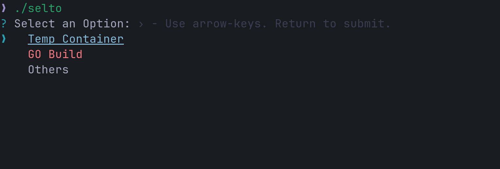

# SelTo - CLI Tool for Command Simplification

SelTo is a lightweight CLI application designed to simplify the execution of complex commands. Instead of memorizing
long command-line sequences, SelTo allows you to configure these commands in a YAML file and then select the appropriate
options through an interactive selection menu.


## Features

- **Interactive Command Selection**: Navigate through options and sub-options defined in the configuration.
- **Configurable via YAML**: Define your commands, parameters, and options in an easy-to-edit YAML format.
- **Support for Placeholders**: Use placeholders (`$n`) to dynamically insert user-selected values into commands.
- **Color-Coded Interface**: Use colors to easily distinguish between options.
- **JSON Schema Support**: A JSON schema is available to ensure that your YAML configuration is valid.

## How SelTo Works

You provide SelTo with a configuration file (`config.yaml`) that defines different commands and options. When you run
SelTo, it reads the file, displays the options, and allows you to select the appropriate configuration through a series
of menus. Once selected, the corresponding command is executed with the correct parameters.

### Example Use Case

Imagine needing to run a temporary container with the current directory mounted, but you need to select the appropriate
Docker image and version each time. Instead of typing out the command manually, you can define it once in the YAML file
and let SelTo handle the rest.

## Example [`config.yaml`](config.yaml)

```yaml
title: "Select an Option"
blocks:
  # Create a temporary container with the current directory mounted
  - display: "Temp Container"
    color: "Blue"
    cmd: "docker run -it --rm -v $PWD:/app -w /app $2:$3"
    title: "Select an Image"
    blocks:
      - value: "golang"
        display: "GoLang"
        color: "BlueBright"
        title: "Select a Version"
        blocks:
          - value: 'alpine'
            display: 'Alpine latest'
            color: "Yellow"

          - value: '1.23-alpine'
            display: "Alpine 1.23"
            color: "Blue"


      - value: "alpine"
        display: "Linux"
        color: "Green"
        title: "Select a Version"
        blocks:
          - value: 'latest'
            display: 'Alpine Latest'
            color: "BlueBright"

          - value: '3.19'
            display: "Alpine 3.19"
            color: "Blue"

      # Build go-application for linux/windows inside a container
  - value: "go-build"
    display: "GO Build"
    color: "Red"
    cmd: "docker run -t --rm -v $PWD:/app -w /app -e GOARCH=amd64 -e GOOS=$2 golang:alpine go build"
    title: "Select a Target-OS"
    blocks:
      - value: "linux"
        display: "Linux/amd64"
        color: "Green"

      - value: "windows"
        display: "Windows/amd64"
        color: "MagentaBright"
```

### Placeholder System

The `$n` placeholder is used to insert values from user selections into the command. For example:

- `$1` refers to the value from the first selection.
- `$2`, `$3`, etc., refer to subsequent selections.

In the example YAML file above, the `$2` and `$3` placeholders correspond to the image and version selected by the user.

## How to Install SelTo

1. **Download the Binary**:
   You can download the pre-built binaries for Windows and Linux from
   the [GitHub release page](https://github.com/liuuner/selto/releases). Once downloaded:

    - **Linux**:
      ```bash
      sudo mv selto /usr/local/bin/selto
      ```
    - **Windows**:
      Place the binary in a folder that is part of your system's `PATH`.

2. **Build from Source** (Go Required):
   If you have Go installed, you can compile and install SelTo yourself:
   ```bash
   go install github.com/liuuner/selto@latest
   ```
   After running this command, the binary will be placed in your Go workspace's `bin` directory, which needs to be part
   of your `PATH` for it to be accessible globally in the terminal.

## How to Use SelTo

1. **Write Your Configuration**:
   Edit or create a `config.yaml` file in the UserConfigDir. On Linux it is `~/.config/selto/` and on Windows
   `C:\Users\<Username>\AppData\Roaming\selto\`.
   If you want to find out more about the Root Config Path see [UserConfigDir](https://pkg.go.dev/os#UserConfigDir).

   You can use the provided JSON schema to validate your configuration.

2. **Run SelTo**:
   To start the interactive selection CLI, simply run:

   ```bash
   selto
   ```

   ### Passing Configuration Options via Flags
   SelTo also supports passing the configuration file path and profile name via flags:

    - **Specify a full path to a configuration file**:
      ```bash
      selto -config /path/to/your/config.yaml
      ```

    - **Specify a profile**:
      ```bash
      selto -profile myprofile
      ```
      The profile will look for a configuration file named `myprofile.yaml` in the default configuration directory.


3. **Make Your Selections**:
   Navigate through the menus using the arrow keys, and press Enter to make selections. SelTo will execute the
   corresponding command based on your choices.

## Configuration Validation

SelTo comes with a JSON schema for validating the structure of your YAML configuration file. It ensures that the
commands, blocks, and placeholders are properly set up, so you don't run into runtime errors.